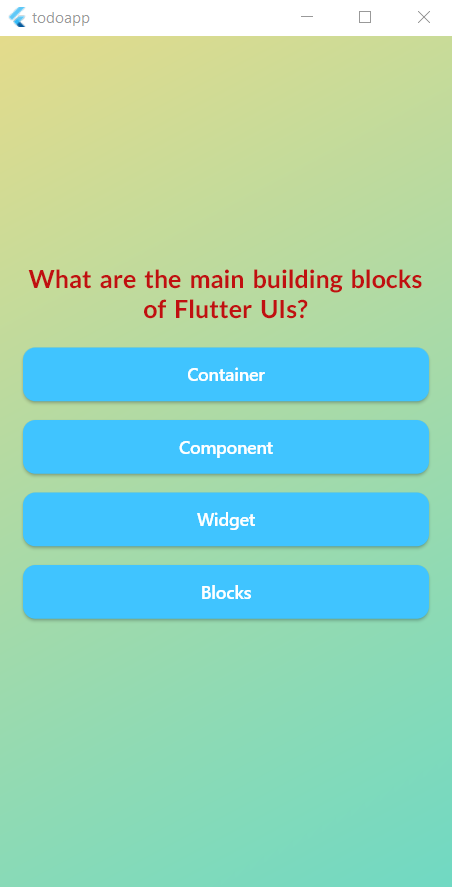
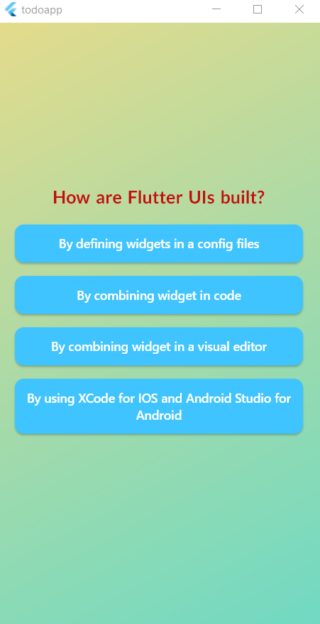
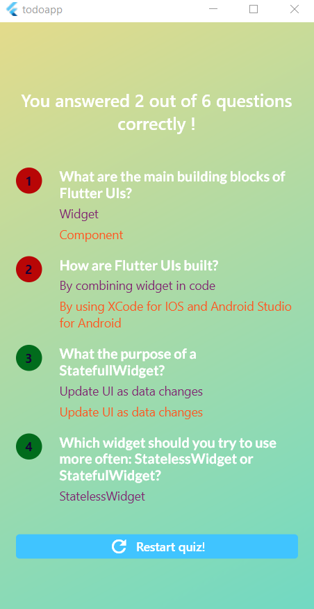

# Todo_App
- Language: **Dart**
- Framework: **Flutter**
- Feature: `Tạo list các công việc cần làm trong ngày / xóa cũng như thay đổi các công việc tùy ý`
### Run application
 - Lựa chọn Virtual Machine cần hiện thực: `Command pallete (Ctrl+shift+P)` --> `Flutter launch emulator` --> lựa chọn thiết bị phù hợp
 - Từ thư mục `lib` --> tìm file **main.dart** --> chọn `Run` --> `Run without Debugging`
 - Tạo **emulator Android** từ Android studio: 
    

### Demo App Exercise Quiz challenge:
- **Home page**: 
- **Screen Question**:  
    - Question 1:
        
        - `khi chọn vào 1 câu trả lời bất kì, câu trả lời sẽ được lưu lại và ứng dụng sẽ chuyển sang câu hỏi kế tiếp !`
    - Question 2:
        
        - `giao diện các câu hỏi còn lại tương tự`
- **Summary question**:
    
    - `giao diện tổng hợp toàn bộ các câu trả lời trong bài quiz của chúng ta - đồng thời thông báo số lương câu trả lời chính xác / tổng số câu hỏi`
    - Chọn vào `button Restart quiz` để bắt đầu lại bài quiz

    
