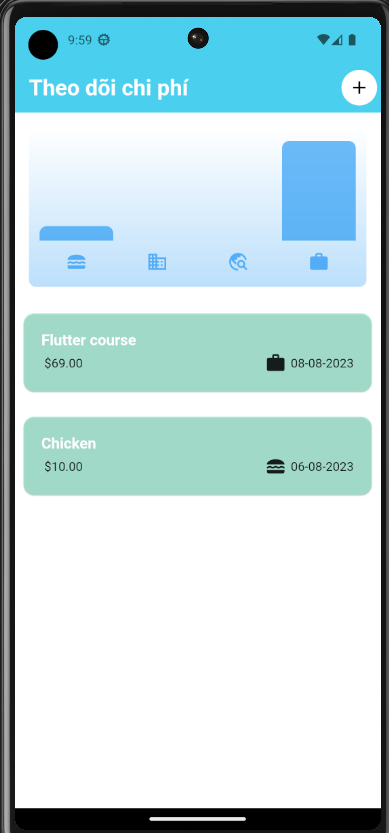

# Expenses Tracker

## Getting Started

This project is a starting point for a Flutter application.

A few resources to get you started if this is your first Flutter project:

- [Lab: Write your first Flutter app](https://docs.flutter.dev/get-started/codelab)
- [Cookbook: Useful Flutter samples](https://docs.flutter.dev/cookbook)

For help getting started with Flutter development, view the
[online documentation](https://docs.flutter.dev/), which offers tutorials,
samples, guidance on mobile development, and a full API reference.

### EXPANSE TRACKER APPLICATION:
- **Feature application:**

    - Tạo danh sách các khoản chi tiêu hàng ngày của người dùng --> Thống kê các `nguồn chi tiêu chính hàng tuần / tháng / năm ` của user.
    - `Hỗ trợ tạo biểu đồ trực để từ đó so sánh` các nguồn chi tiêu chính mà người dùng quan tâm.
    - Thêm / xóa / thay đổi các mục chi phí chính theo yêu cầu người dùng.

- **Screen Application:** 

#### Home application:
 

 #### Add new cost in application:
  

#### Delete item Cost in application:
 

